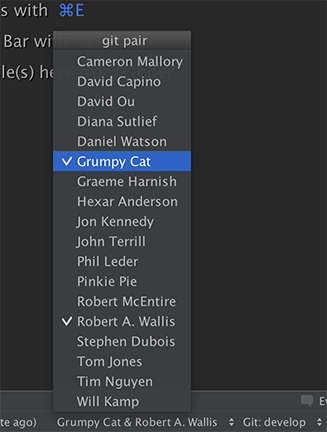

# Git Pair

Pair programming plugin for the Idea platform ([IntelliJ](https://www.jetbrains.com/idea/), [AppCode](https://www.jetbrains.com/objc/), [Android Studio](http://developer.android.com/tools/studio/index.html)).

Like [Pivotal Lab's Git Scripts](https://github.com/pivotal/git_scripts), but for the best IDE ever built.

On my teams we often ask "Wait, who's paired right now?"  It's a bit inconvenient to find that information.  This plugin shows on screen who is paired, and allows you to change the pair.  Modeled after the git4idea plugin which allows you to see the branch you are on and quickly switch branches.




# Installation

Add a `.pairs` file to your project's root folder in this format:

```
# This is for the awesome git pair https://plugins.jetbrains.com/plugin/8135 plugin.
# But it works with the Pivotal Labs `git pair` plugin too.

pairs:
  gc: Grumpy Cat;grumpy.cat
  pp: Pinkie Pie; pinkie.pie
  rw: Robert A. Wallis; robert.wallis

email:
  prefix:
  domain: example.com

global: true
```

## Multiple Domains

Maybe you have contractors that have different domains, or maybe you pair with personal email addresses.
How can you configure your `.pairs` file to support multiple domains?

```
# This is for the awesome git pair https://plugins.jetbrains.com/plugin/8135 plugin.
# But it works with the Pivotal Labs `git pair` plugin too.

pairs:
  gc: Grumpy Cat
  rw: Robert Wallis

email_addresses:
  gc: grumpy.cat@example.com
  rw: smilingrob@gmail.com
```

The domain chosen is in alphabetical order based on name.
So in the example above, `example.com` will always be chosen if Grumpy Cat pairs with
Robert because "G" comes before "R".  And the commit email will be `grumpy.cat+smilingrob@example.com`. 

# FAQ

### Why not just use the command line?

Because the current `git pair` is not visible on the screen at a glance.  And typing `git pair` will reset your pair to nothing.

You could use the [pivotal scripts](https://github.com/pivotal/git_scripts) since this plugin will not work in XCode or Visual Studio.  On the other hand, there's always [AppCode](https://www.jetbrains.com/objc/) and [CLion](https://www.jetbrains.com/clion/)... (I can haz free licences jetbrains?  For testing my plugin?)

### Why not just do a pull-request on the git4idea plugin?

Because `git pair` is a not in core git, it's a plugin for git.  Not everyone that uses git, also does pair programming.
